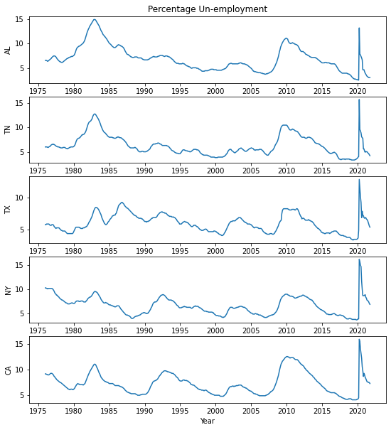

Our aim in this workshop is to make you familiar with the basics of Python, focusing on those aspects that will jump-start your ability to write data-science programs.

In other words, we want to make you dangerous enough soon :-).

Accordingly, we will cover fundamental python concepts including variables, lists, dictionaries, iteration, and functions; moving on to useful list like objects such as Pandas Series and numpy ndarrays, and their use in analyzing and making plots of data.

Here is the outline:

1. Getting Started
2. Libraries and Functions
3. Dictionaries
4. Listiness
5. Plotting with matplotlib
6. Putting it all together

We will end up with code that plots unemployment rates in multiple American states. This example exercises all basic python concepts for data science..if you understand it you are golden!

Finally, a homework problem will help cement your understanding, and make you even more dangerous!# PythonWorkshop
